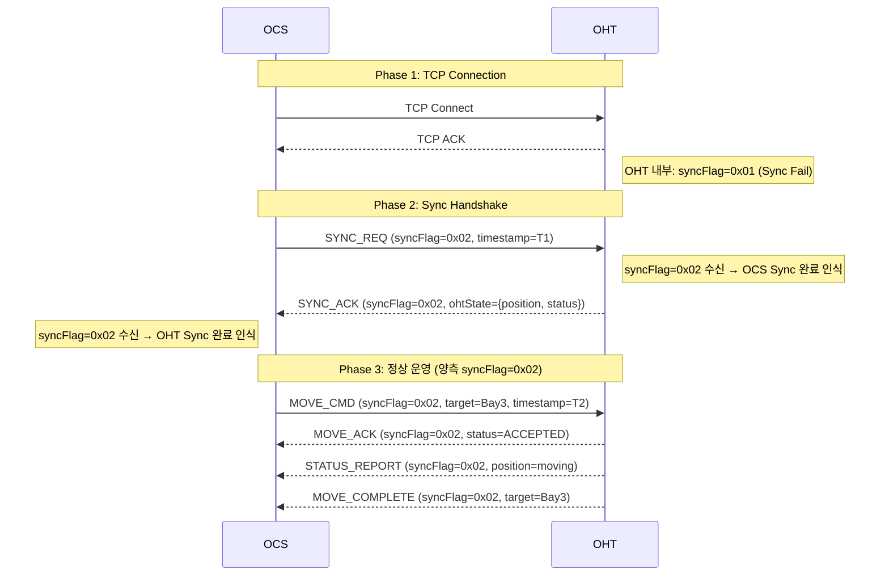
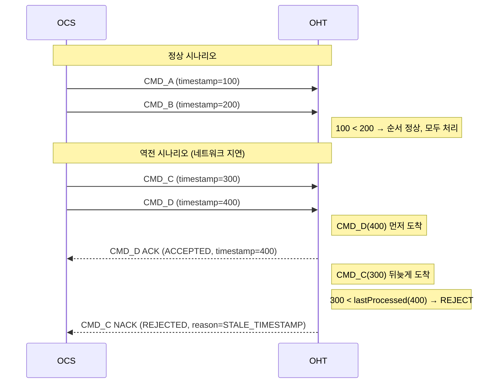
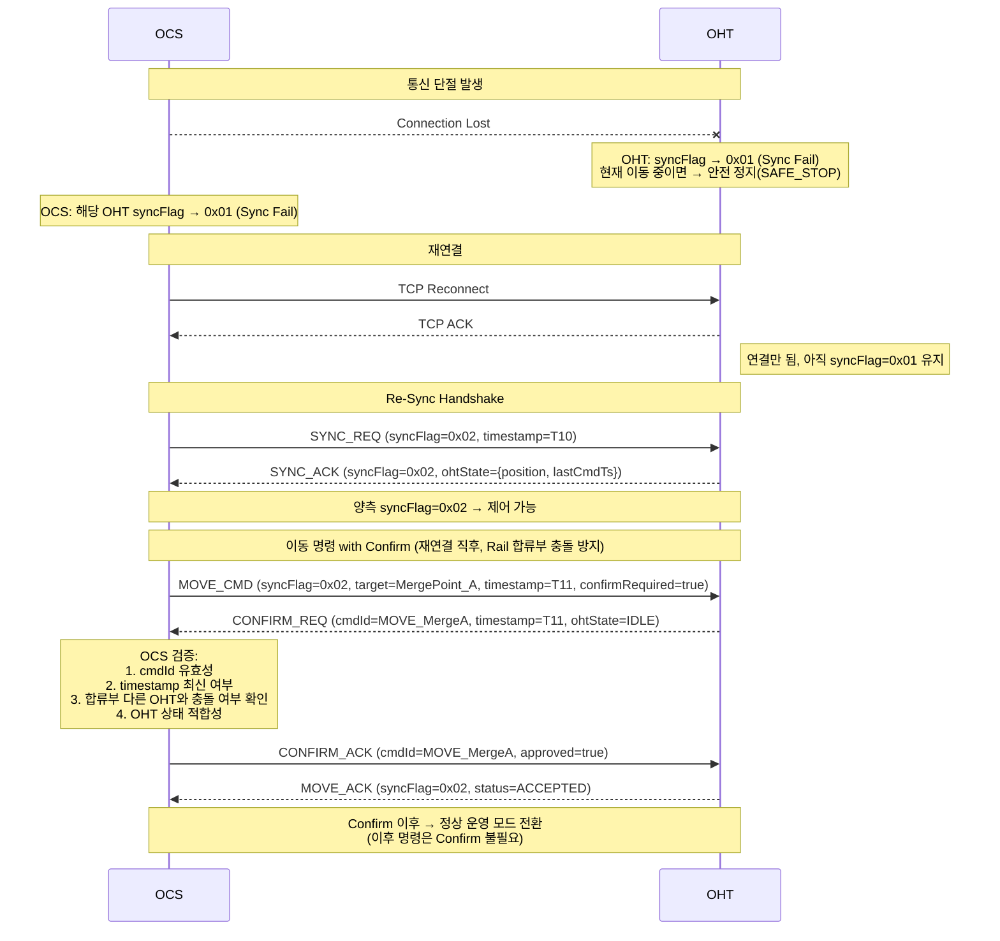
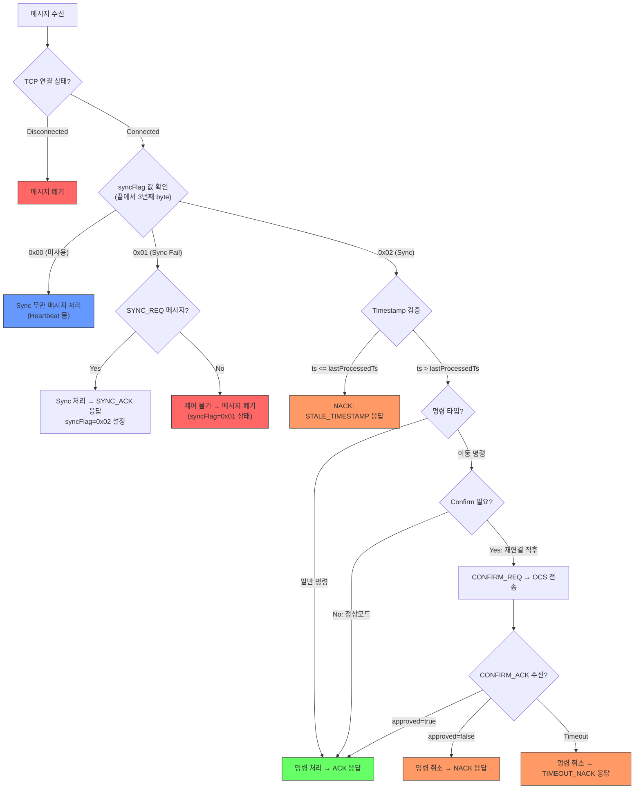
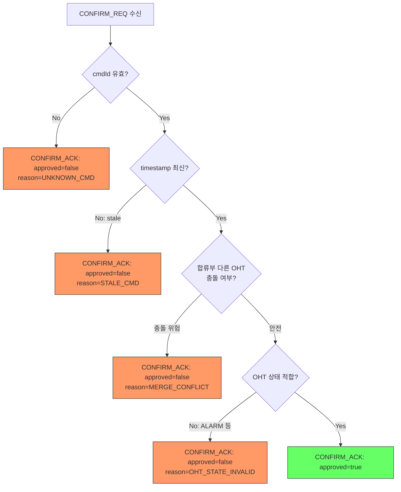
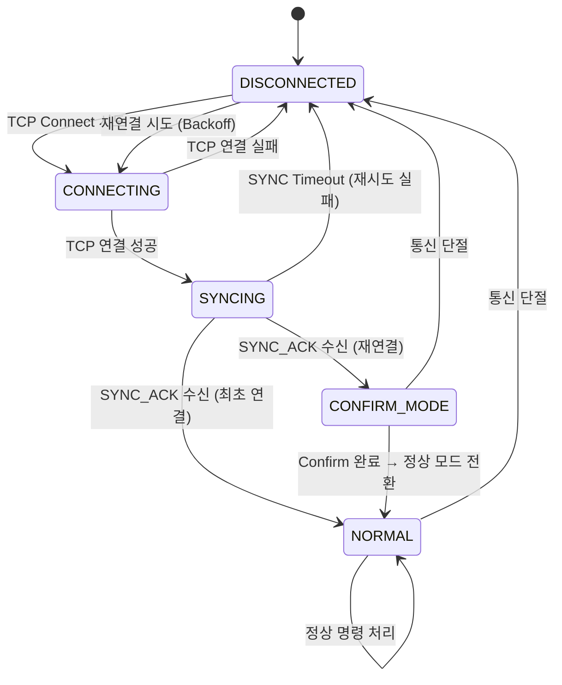

# OCS-OHT 통신 제어 프로토콜 개발 명세서

| 항목 | 내용 |
|------|------|
| **문서 번호** | OCS-OHT-COMM-SPEC-001 |
| **버전** | 1.0 (Draft) |
| **작성일** | 2026-03-09 |
| **상태** | 심의 대기 |

---

## 1. 개요

### 1.1 목적

본 문서는 OCS(Overhead Control System)와 OHT(Overhead Hoist Transport) 간 통신 제어 프로토콜의 요구사항 및 개발 명세를 정의한다. 특히 **통신 안정성 확보**와 **Rail 합류부(Merge Point)에서의 OHT 간 물리적 충돌 방지**를 핵심 목표로 한다.

### 1.2 적용 범위

| 구분 | 내용 |
|------|------|
| 적용 시스템 | OCS ↔ OHT 간 TCP 기반 바이너리 통신 |
| 대상 기능 | 연결 동기화, 명령 전송, 재연결 복구 |
| 제외 범위 | OHT 물리 제어(모터, 센서), Rail 레이아웃 관리 |

### 1.3 용어 정의

| 용어 | 정의 |
|------|------|
| **OCS** | OHT 군을 통합 제어하는 상위 시스템 |
| **OHT** | Rail 위를 주행하며 반송 작업을 수행하는 반송 장비 |
| **Sync Flag** | 통신 메시지 내 양측의 제어 가능 여부를 나타내는 플래그 |
| **Merge Point** | 복수의 Rail 경로가 합류하는 지점 — 충돌 위험 구간 |
| **Stale 명령** | 통신 단절 이전에 발행되어 현재 상황에 유효하지 않은 명령 |
| **Confirm** | 재연결 직후 OHT가 이동 명령의 유효성을 OCS에 재확인하는 절차 |

---

## 2. 요구사항 정의

### 2.1 기능 요구사항

| ID | 요구사항 | 목적 | 우선순위 |
|----|---------|------|----------|
| **FR-01** | 통신 연결 후 Sync Flag를 이용하여 상호 제어 가능 여부를 판단한다 | 양측 상태 동기화 보장, Half-Open 연결 방지 | 필수 |
| **FR-02** | OCS→OHT 전송 모든 명령에 Timestamp를 포함한다 | 네트워크 지연에 의한 패킷 순서 역전(out-of-order) 방지 | 필수 |
| **FR-03** | Disconnect→Connect 이후 OCS→OHT 이동 명령에 대해 OHT→OCS Confirm을 요청한다 | **Rail 합류부에서 OHT 간 물리적 충돌 방지** — stale 이동 명령이 실행될 경우 합류부 진입 타이밍이 어긋나 충돌 위험 | 필수 |

### 2.2 비기능 요구사항

| ID | 요구사항 | 기준 |
|----|---------|------|
| **NFR-01** | Sync Handshake는 연결 후 일정 시간 내 완료되어야 한다 | Timeout 및 Retry 정책 별도 협의 |
| **NFR-02** | Confirm 응답은 일정 시간 내 수신되어야 한다 | Timeout 정책 별도 협의 |
| **NFR-03** | 통신 단절 시 OHT는 안전 정지(Safe Stop)를 수행한다 | 물리적 안전 최우선 |

### 2.3 제약사항

| ID | 내용 |
|----|------|
| **CON-01** | 기존 바이너리 메시지 포맷의 Trailer 영역을 활용한다 (신규 필드 추가 최소화) |
| **CON-02** | Sync Flag는 모든 메시지 타입에 공통 적용된다 |
| **CON-03** | Timestamp는 OCS→OHT 방향 명령에만 적용된다 |

---

## 3. 인터페이스 명세

### 3.1 Sync Flag 정의

| 항목 | 규격 |
|------|------|
| **위치** | 바이너리 메시지 끝에서 3번째 byte (Trailer 영역) |
| **크기** | 1 byte |
| **적용 범위** | 모든 메시지 타입에 공통 적용 |

| 값 | 명칭 | 의미 | 사용 시점 |
|----|------|------|----------|
| `0x00` | **미사용** | Sync 절차와 무관한 메시지 | Heartbeat 등 일반 메시지 |
| `0x01` | **Sync Fail** | 제어 불가 상태 | 연결 직후 초기값, 동기화 실패 시 |
| `0x02` | **Sync** | 제어 가능 상태 | Sync Handshake 완료 후 |

**`0x00`(미사용) 도입 배경:**

운영 환경에서 **전체 OHT를 동시에 업데이트하는 것은 불가능**하다. Fab 내 수백~수천 대의 OHT가 운행 중이므로 S/W 업데이트는 순차적·단계적으로 진행된다. 이로 인해 동일 시점에 **업데이트된 OHT**와 **미업데이트 OHT**가 혼재하게 된다.

| 구분 | syncFlag 값 | OCS 인식 |
|------|------------|----------|
| 미업데이트 OHT | 항상 `0x00` (Sync 로직 미탑재) | 기존 방식으로 제어 (Sync 절차 생략) |
| 업데이트 OHT | `0x01` 또는 `0x02` | Sync 기반 제어 적용 |

`0x00`을 도입함으로써 OCS는 수신 메시지의 syncFlag 값만으로 해당 OHT가 신규 프로토콜을 지원하는지 즉시 식별할 수 있으며, **단계적 전환(Rolling Update) 기간에도 기존 OHT와의 하위 호환성이 유지**된다.

**Sync Flag 판단 로직:**

| 수신 측 현재 상태 | 수신된 syncFlag | 판단 | 행동 |
|------------------|----------------|------|------|
| 임의 | `0x00` | Sync 미지원 OHT (미업데이트) | Sync 상태 변경 없이 기존 방식 처리 |
| `0x01` (미동기화) | `0x02` | 상대방 Sync 완료 | SYNC_ACK(`0x02`) 응답 → 양측 Sync |
| `0x02` (동기화) | `0x01` | 상대방 Sync 실패 | 자신도 `0x01`로 전환. 제어 명령 수신 거부 |
| `0x02` (동기화) | `0x02` | 정상 | 명령 정상 처리 |

### 3.2 바이너리 메시지 포맷

```
                 Binary Message Format (Big-Endian)

Byte Offset:   0        2        10       14       14+N     N+14  N+15  N+16
              ┌────────┬────────┬────────┬────────┬────────┬─────┬─────┬─────┐
              │msgType │ times- │ cmdId  │confirm │payload │sync │ (2) │ (1) │
              │        │  tamp  │        │Required│        │Flag │     │     │
              │ 2 byte │ 8 byte │ 4 byte │ 1 byte │ N byte │1byte│     │     │
              └────────┴────────┴────────┴────────┴────────┴─────┴─────┴─────┘
                                                            ↑
                                                     끝에서 3번째 byte
```

**필드 상세:**

| 필드 | Offset | 크기 | 설명 |
|------|--------|------|------|
| `msgType` | 0 | 2 byte | 메시지 타입 식별자 |
| `timestamp` | 2 | 8 byte | OCS 발행 시각 (epoch ms). OCS→OHT 명령에만 유효 |
| `cmdId` | 10 | 4 byte | 명령 고유 식별자 |
| `confirmRequired` | 14 | 1 byte | Confirm 필요 여부 (`0x00`=불필요, `0x01`=필요) |
| `payload` | 15 | N byte | 메시지 타입별 가변 데이터 |
| `syncFlag` | **끝-3** | 1 byte | `0x00`/`0x01`/`0x02` |

### 3.3 Timestamp 순서 검증 규칙

| 규칙 | 설명 |
|------|------|
| **비교 기준** | OHT는 `lastProcessedTimestamp` 값을 유지 |
| **수락 조건** | 수신 `timestamp` > `lastProcessedTimestamp` |
| **거부 조건** | 수신 `timestamp` ≤ `lastProcessedTimestamp` → **NACK (STALE_TIMESTAMP)** |
| **갱신 시점** | 명령 수락(ACK) 시 `lastProcessedTimestamp` 갱신 |

### 3.4 Confirm 프로토콜

**적용 조건:** Disconnect → Reconnect → Sync 완료 직후, OCS가 전송하는 **이동 명령**에 한해 적용

| 단계 | 방향 | 메시지 | 설명 |
|------|------|--------|------|
| 1 | OCS → OHT | `MOVE_CMD` (`confirmRequired=0x01`) | 이동 명령 전송 |
| 2 | OHT → OCS | `CONFIRM_REQ` | 명령 유효성 재확인 요청 (OHT 현재 상태 포함) |
| 3 | OCS → OHT | `CONFIRM_ACK` | 승인(`approved=true`) 또는 거부(`approved=false`) |
| 4 | OHT | 내부 처리 | 승인 시 명령 실행, 거부 시 명령 폐기 |

**OCS Confirm 검증 항목:**

| # | 검증 항목 | 거부 사유 |
|---|----------|----------|
| 1 | 명령 ID(`cmdId`) 유효성 | `UNKNOWN_CMD` |
| 2 | Timestamp 최신 여부 | `STALE_CMD` |
| 3 | Rail 합류부 다른 OHT 충돌 여부 | `MERGE_CONFLICT` |
| 4 | OHT 상태 적합성 (ALARM 등) | `OHT_STATE_INVALID` |

---

## 4. 프로토콜 시나리오

### 4.1 정상 연결 및 Sync 절차



### 4.2 패킷 순서 역전 방어



### 4.3 Disconnect → Reconnect → Confirm 흐름 (Rail 합류부 충돌 방지)



---

## 5. 처리 흐름도

### 5.1 OHT 메시지 수신 처리



### 5.2 OCS Confirm 검증 처리



---

## 6. 상태 전이

### 6.1 OHT 통신 상태 모델



### 6.2 상태별 허용 동작

| 상태 | Sync Flag | 허용 동작 | 비고 |
|------|-----------|----------|------|
| **DISCONNECTED** | — | TCP 연결 시도만 가능 | OHT: 이동 중이었다면 Safe Stop |
| **CONNECTING** | — | TCP Handshake 대기 | — |
| **SYNCING** | `0x01` | SYNC_REQ/ACK 교환만 가능 | 제어 명령 수신 거부 |
| **CONFIRM_MODE** | `0x02` | 이동 명령은 Confirm 필수 | 일반 명령은 즉시 처리 |
| **NORMAL** | `0x02` | 모든 명령 즉시 처리 | 정상 운영 |

---

## 7. 이상 처리 (Abnormal Handling)

### 7.1 통신 단절 시 동작

| 주체 | 동작 | 상세 |
|------|------|------|
| **OHT** | 즉시 Safe Stop | 이동 중이었다면 감속 → 정지. syncFlag → `0x01` |
| **OCS** | 해당 OHT 상태를 Sync Fail로 전환 | 해당 OHT로의 명령 발행 중단. 합류부 스케줄링에서 제외 |

### 7.2 패킷 순서 역전 시 동작

| 조건 | OHT 동작 | OCS 후속 처리 |
|------|---------|--------------|
| 수신 `timestamp` ≤ `lastProcessedTimestamp` | NACK (`STALE_TIMESTAMP`) 응답 | 해당 명령 폐기. 필요 시 재발행 |

### 7.3 Confirm 실패 시 동작

| 상황 | OHT 동작 | OCS 후속 처리 |
|------|---------|--------------|
| `approved=false` (MERGE_CONFLICT) | 이동 명령 폐기. 현재 위치 유지 | 합류부 안전 확보 후 명령 재발행 |
| `approved=false` (OHT_STATE_INVALID) | 이동 명령 폐기 | OHT 상태 정상화 후 재발행 |
| Confirm Timeout (응답 없음) | 이동 명령 폐기 → TIMEOUT_NACK 전송 | 통신 상태 확인 후 재발행 |

---

## 8. 심의 확인 사항

> [!IMPORTANT]
> 아래 항목은 개발 착수 전 고객과의 심의에서 **반드시** 합의되어야 하는 사항입니다.

### 8.1 설계 검토에서 식별된 이슈

| # | 이슈 | 영향도 | 권고안 | 심의 결과 |
|---|------|--------|--------|----------|
| I-1 | **Timestamp만으로는 동일 밀리초 내 복수 명령의 순서 구분 불가** | 중 | Monotonic Sequence Number를 Timestamp와 병용 (`{timestamp, seqNo}` 복합 키) | |
| I-2 | **Confirm 모드 해제 조건 미정의** — 무한 유지 시 성능 저하, 조기 해제 시 안전성 약화 | 고 | 재연결 후 첫 이동 명령만 Confirm 적용 (First-Command 방식) | |
| I-3 | **Sync Timeout 미정의** — SYNC_ACK 미수신 시 무한 대기 위험 | 고 | Timeout + Retry + 실패 시 재연결 | |
| I-4 | **Confirm Timeout 미정의** — CONFIRM_ACK 미수신 시 OHT 멈춤 위험 | 고 | Timeout 후 자동 명령 취소 + TIMEOUT_NACK | |
| I-5 | **Disconnect 시 OHT 안전 정지 정책 상세 미정의** | 최고 | Safe Stop (감속→정지) 정책 명문화 필수 | |

**이슈별 사례 시나리오:**

> **I-1 사례 — 동일 ms 내 MOVE/STOP 역전**
>
> OCS가 OHT-017에 `MOVE_CMD(ts=1710000000000)` 직후 긴급 `STOP_CMD(ts=1710000000000)`를 발행한다. 네트워크 지연으로 STOP이 먼저 도착하면 OHT는 STOP 처리 후 뒤늦게 도착한 MOVE를 **같은 timestamp이므로 순서 판단 불가** → MOVE를 수락하여 의도하지 않은 주행이 시작된다. Sequence Number가 있었다면 `STOP(seq=102)` > `MOVE(seq=101)` 비교로 MOVE를 거부할 수 있다.

> **I-2 사례 — Confirm 모드 무한 유지로 인한 운행 지연**
>
> OHT-042가 재연결 후 Confirm 모드에 진입한다. 해제 조건이 없어 이후 모든 이동 명령마다 OCS와 Confirm 왕복이 발생한다. 특히 고밀도 Bay 구간에서 초당 수 회의 이동 명령이 발행되는 경우, **Confirm 왕복 지연(~3초)이 누적**되어 해당 OHT의 반송 처리량(throughput)이 급격히 저하되고 후방 OHT들도 연쇄적으로 정체된다.

> **I-3 사례 — Sync 무한 대기로 OHT 고립**
>
> OHT-108이 재부팅 후 TCP는 연결되었으나 OCS의 SYNC_REQ 패킷이 네트워크 장비 장애로 유실된다. Timeout 정책이 없으면 OHT-108은 syncFlag=`0x01` 상태에서 **무한 대기** → OCS도 해당 OHT를 제어 불가로 인식하지만 재연결을 시도하지 않으므로, 수동 개입 전까지 OHT가 Rail 위에서 고립된다.

> **I-4 사례 — Confirm 대기 중 Rail 점유로 후방 OHT 정체**
>
> OHT-073이 합류부 앞에서 CONFIRM_REQ를 OCS에 전송하지만 OCS 측 네트워크 부하로 CONFIRM_ACK가 지연된다. Timeout이 없으면 OHT-073은 합류부 진입 직전 위치에서 **무한 정지** 상태가 되며, 해당 Rail 구간을 점유하여 후방 OHT 5~10대가 연쇄 정체된다. 고밀도 운영 환경에서는 한 대의 멈춤이 Fab 전체 반송 효율에 영향을 미친다.

> **I-5 사례 — 합류부 통신 단절로 OHT 충돌**
>
> OHT-025가 합류부 진입 중(속도 1.5m/s) OCS와 통신이 단절된다. Safe Stop 정책이 미정의 상태에서 OHT-025는 **관성에 의해 합류부를 그대로 통과**한다. 동시에 OCS는 OHT-025의 위치를 파악하지 못한 채 다른 경로의 OHT-089에 합류부 진입 명령을 발행한다. 두 OHT가 합류부에서 동시 진입하여 **물리적 충돌**이 발생한다. Safe Stop이 정의되어 있었다면 OHT-025는 단절 즉시 감속→정지하여 합류부 내부에 머무르지 않았을 것이다.

### 8.2 확정 필요 파라미터

| # | 파라미터 | 권고값 | 확정값 |
|---|---------|--------|--------|
| P-1 | Sync Timeout (SYNC_ACK 대기 시간) | 5초 | |
| P-2 | Sync Retry 횟수 | 3회 | |
| P-3 | Confirm Timeout (CONFIRM_ACK 대기 시간) | 3초 | |
| P-4 | Timestamp 시각 동기화 방안 | NTP | |
| P-5 | Heartbeat/KeepAlive 주기 | — | |
| P-6 | 통신 단절 판정 임계치 (Heartbeat Miss 횟수) | — | |
| P-7 | 재연결 Backoff 초기값 / 최대값 | — | |

### 8.3 안전 관련 확인 사항

> [!CAUTION]
> 아래 항목은 **물리적 장비 안전**에 직결되므로 반드시 심의에서 확정하여야 합니다.

| # | 항목 | 상세 |
|---|------|------|
| S-1 | 통신 단절 시 Safe Stop 감속 프로파일 (감속도, 정지까지 소요 시간) | |
| S-2 | Safe Stop 후 OHT 재기동 절차 (자동 vs 수동 복구) | |
| S-3 | 합류부 Confirm 거부 시 후속 스케줄링 정책 | |

---

## 부록

### A. 변경 이력

| 버전 | 일자 | 변경 내용 | 작성자 |
|------|------|----------|--------|
| 1.0 | 2026-03-09 | 초안 작성 | — |

### B. 관련 문서

| 문서명 | 비고 |
|--------|------|
| OCS-OHT 통신 프로토콜 설계 검토 보고서 | 본 명세서의 근거 분석 문서 |
