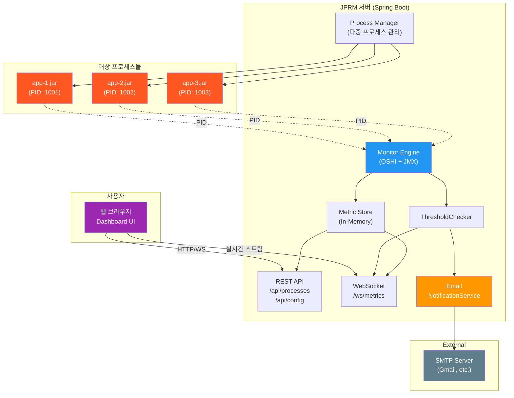
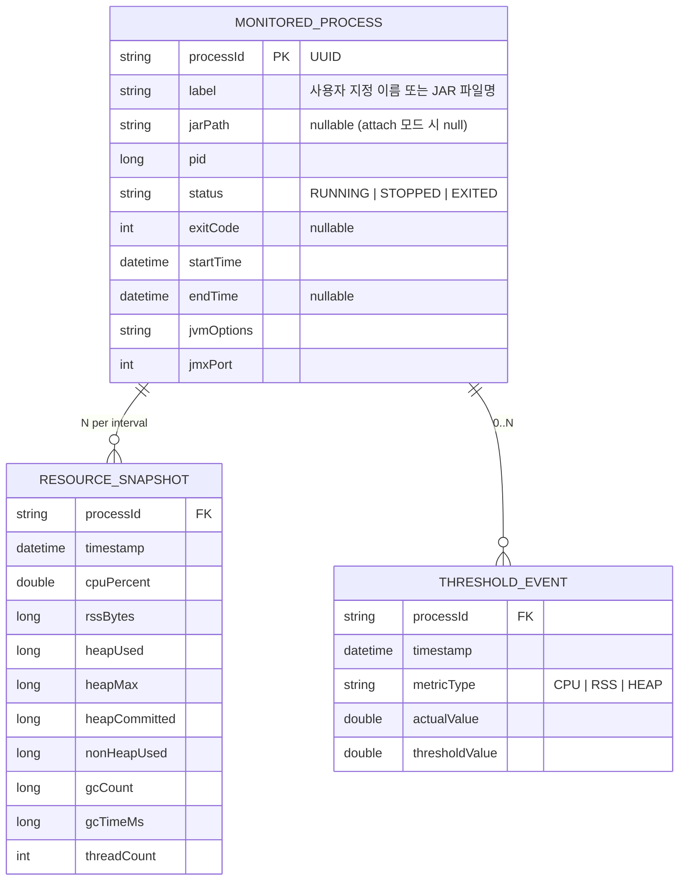
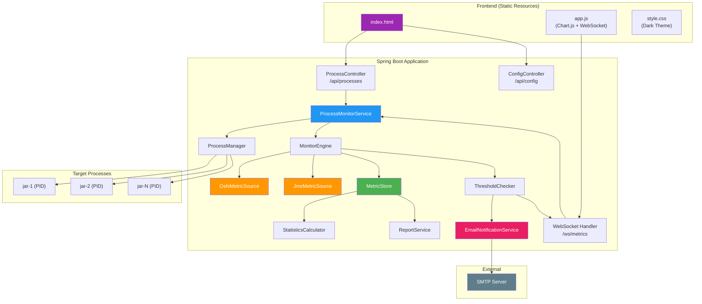
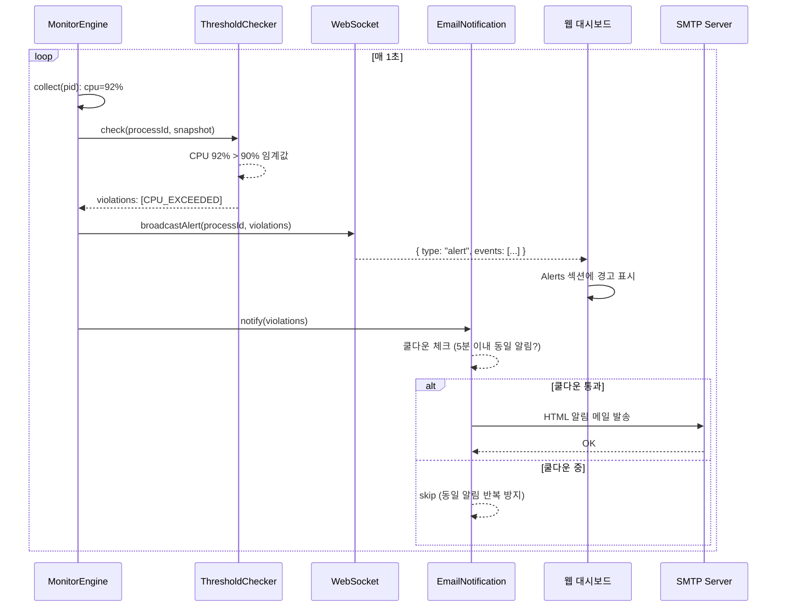
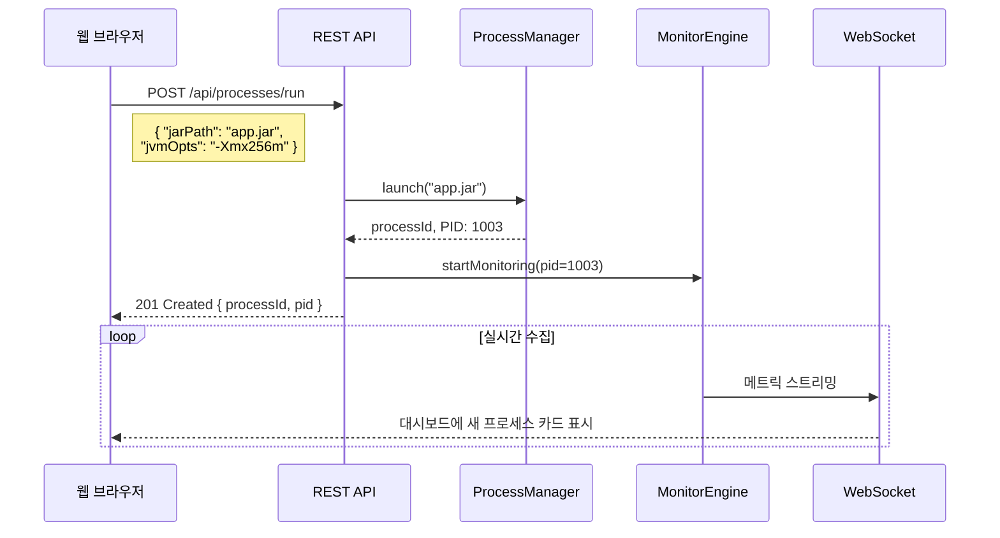

# Java JAR Process Resource Monitor — 개발 명세서 (SRS) v3.1

> **문서 버전:** v3.1  
> **작성일:** 2026-04-07  
> **표준 기반:** IEEE 830-1998, ISO/IEC/IEEE 29148:2018

---

## 변경 이력

| 버전 | 변경 사항 |
|:---|:---|
| v1.0 | 최초 작성 (JUnit Extension 기반 — 요구사항 불일치로 폐기) |
| v2.0 | JAR 실행 + 외부 모니터링 CLI 도구로 전면 재설계 |
| v3.0 | Maven 전환, Web 대시보드(실시간), JDK 21, 다중 JAR 모니터링 지원 |
| **v3.1** | **임계값 웹 UI 동적 변경, 이메일 알림(SMTP), WebSocket 알림 push 추가** |

> [!IMPORTANT]
> **v3.1 주요 변경점**
> 1. 임계값(CPU/Heap/RSS)을 웹 대시보드 Settings에서 **동적으로 변경** 가능
> 2. 임계값 초과 시 **이메일(SMTP) 알림** 자동 발송 (쿨다운 로직 포함)
> 3. 임계값 초과 이벤트를 **WebSocket으로 실시간 push** → 대시보드에 Alert 표시
> 4. 설정 관리 REST API 신규 추가 (`/api/config/threshold`, `/api/config/notification`)

---

## 1. 소개 (Introduction)

### 1.1 목적 (Purpose)
본 문서는 **1개 이상의 Java JAR 파일을 실행하고, 각 프로세스의 CPU 및 메모리 사용량을 웹 대시보드를 통해 실시간으로 모니터링·기록·보고**하는 도구(이하 **JPRM**, Java Process Resource Monitor)의 시스템 요구사항 명세서입니다.

### 1.2 범위 (Scope)

#### In-Scope
| 항목 | 설명 |
|:---|:---|
| 다중 JAR 실행 | 1개 이상의 JAR 파일을 동시에 실행하고 각각 독립 모니터링 |
| CPU 모니터링 | 각 프로세스별 CPU 사용률(%) 실시간 수집 |
| 메모리 모니터링 | 각 프로세스별 RSS, JVM Heap 사용량 수집 |
| **웹 대시보드** | 브라우저 기반 실시간 모니터링 UI (WebSocket 기반 라이브 업데이트) |
| 기존 프로세스 Attach | PID로 이미 실행 중인 Java 프로세스를 모니터링 대상에 추가 |
| **임계값 알림** | CPU/Heap/RSS 임계값 초과 시 대시보드 경고 + 이메일 알림 |
| 리포트 생성 | JSON/CSV 형식의 결과 보고서 |
| REST API | 프로그래밍 방식으로 모니터링 데이터 접근 및 설정 변경 |

#### Out-of-Scope
| 항목 | 사유 |
|:---|:---|
| 원격 서버 모니터링 | 1차에서는 로컬 머신 전용 |
| Thread Dump / Heap Dump | 전문 프로파일러 영역 |
| 클라우드 메트릭 연동 | Prometheus/Grafana 등은 향후 확장 |

### 1.3 용어 정의

| 용어 | 정의 |
|:---|:---|
| **PID** | Process ID — OS가 부여하는 프로세스 식별자 |
| **RSS** | Resident Set Size — 프로세스가 실제로 물리 메모리에 올린 크기 |
| **JMX** | Java Management Extensions — JVM 런타임 메트릭 접근 표준 API |
| **OSHI** | Operating System and Hardware Information — 크로스플랫폼 시스템 정보 라이브러리 |
| **WebSocket** | 서버-클라이언트 간 전이중(Full-Duplex) 실시간 통신 프로토콜 |
| **SMTP** | Simple Mail Transfer Protocol — 이메일 전송 프로토콜 |

---

## 2. 전체 설명 (Overall Description)

### 2.1 제품 관점 (Product Perspective)



JPRM은 **Spring Boot 기반 웹 애플리케이션**으로, 내장 웹 서버를 통해 대시보드 UI를 제공하고, WebSocket으로 실시간 메트릭과 알림을 브라우저에 스트리밍합니다.

### 2.2 운영 모드 (Operating Modes)

| 모드 | 설명 |
|:---|:---|
| **Run** | JAR 파일을 실행하고 모니터링 시작 |
| **Attach** | 이미 실행 중인 프로세스에 PID로 연결 |
| **Mixed** | 웹 UI에서 동적으로 JAR/PID 추가 |

### 2.3 제약 사항 (Constraints)

| 제약 | 설명 |
|:---|:---|
| **JDK** | **JDK 21** (LTS) 필수 |
| **빌드** | **Maven** 3.9+ |
| **프레임워크** | Spring Boot 3.3+ (JDK 21 지원) |
| **플랫폼** | Windows, Linux, macOS 크로스 플랫폼 (OSHI 기반) |
| **브라우저** | Chrome, Firefox, Edge 최신 버전 |

---

## 3. 상세 요구사항 (Specific Requirements)

### 3.1 기능 요구사항 (Functional Requirements)

---

#### 3.1.1 다중 프로세스 관리 (Multi-Process Management)

| ID | 요구사항 | 우선순위 | 구현 상태 |
|:---|:---|:---|:---|
| **FR-PM-01** | 1개 이상의 JAR 파일을 동시에 실행하고 각각 독립적으로 모니터링한다 | 필수 | ✅ |
| **FR-PM-02** | 각 프로세스에 고유 ID를 부여하고 상태(RUNNING, STOPPED, EXITED)를 관리한다 | 필수 | ✅ |
| **FR-PM-03** | 웹 UI 또는 REST API를 통해 실행 중에 새로운 JAR/PID를 동적으로 추가할 수 있다 | 필수 | ✅ |
| **FR-PM-04** | 웹 UI 또는 REST API를 통해 개별 프로세스를 중지(stop)할 수 있다 | 필수 | ✅ |
| **FR-PM-05** | 프로세스가 종료되면 해당 프로세스의 모니터링을 자동 중지하고 상태를 EXITED로 변경한다 | 필수 | ✅ |

---

#### 3.1.2 메트릭 수집 (Metric Collection) — 2계층

| ID | 요구사항 | 계층 | 우선순위 | 구현 상태 |
|:---|:---|:---|:---|:---|
| **FR-COL-01** | 각 프로세스의 CPU 사용률(%)을 OSHI로 수집한다 | OS | 필수 | ✅ |
| **FR-COL-02** | 각 프로세스의 RSS(물리 메모리)를 OSHI로 수집한다 | OS | 필수 | ✅ |
| **FR-COL-03** | 각 프로세스의 JVM Heap 사용량(Used/Max)을 JMX로 수집한다 | JVM | 필수 | ✅ |
| **FR-COL-04** | GC 횟수 및 누적 소요 시간을 JMX로 수집한다 | JVM | 필수 | ✅ |
| **FR-COL-05** | 활성 스레드 수를 JMX로 수집한다 | JVM | 선택 | ✅ |
| **FR-COL-06** | 수집 간격을 설정 가능하게 한다 (기본: 1초) | - | 필수 | ✅ |
| **FR-COL-07** | JMX 연결 실패 시 OS 수준 수집만 계속한다 (Graceful Degradation) | - | 필수 | ✅ |

---

#### 3.1.3 웹 대시보드 (Web Dashboard)

| ID | 요구사항 | 우선순위 | 구현 상태 |
|:---|:---|:---|:---|
| **FR-WEB-01** | Spring Boot 내장 웹 서버로 대시보드를 제공한다 (기본 포트: 8080) | 필수 | ✅ |
| **FR-WEB-02** | WebSocket을 통해 메트릭을 실시간 스트리밍한다 (1초 간격 push) | 필수 | ✅ |
| **FR-WEB-03** | 모니터링 중인 전체 프로세스 목록을 카드 형태로 표시한다 | 필수 | ✅ |
| **FR-WEB-04** | 각 프로세스의 CPU/메모리 실시간 차트 (Line Chart)를 표시한다 | 필수 | ✅ |
| **FR-WEB-05** | 프로세스를 선택하면 상세 정보(Heap, GC, Thread 등)를 표시한다 | 필수 | ✅ |
| **FR-WEB-07** | 웹 UI에서 [+ Add JAR] 버튼으로 새 JAR을 실행 추가할 수 있다 | 필수 | ✅ |
| **FR-WEB-08** | 웹 UI에서 [+ Attach PID] 버튼으로 기존 프로세스를 추가할 수 있다 | 필수 | ✅ |
| **FR-WEB-09** | 임계값 초과 시 대시보드에서 시각적 경고(Alerts 섹션)를 표시한다 | 필수 | ✅ |
| **FR-WEB-10** | 대시보드에서 리포트 내보내기(JSON/CSV) 버튼을 제공한다 | 필수 | ✅ |
| **FR-WEB-11** | 대시보드 테마는 다크 모드 기반의 모던 디자인으로 한다 | 필수 | ✅ |
| **FR-WEB-12** | Settings 모달에서 임계값을 동적으로 변경할 수 있다 | 필수 | ✅ |
| **FR-WEB-13** | Settings 모달에서 이메일 알림을 활성화/비활성화할 수 있다 | 필수 | ✅ |

---

#### 3.1.4 REST API

| ID | 엔드포인트 | 메서드 | 설명 | 구현 상태 |
|:---|:---|:---|:---|:---|
| **FR-API-01** | `/api/processes` | GET | 모니터링 중인 전체 프로세스 목록 | ✅ |
| **FR-API-02** | `/api/processes/{id}` | GET | 특정 프로세스의 상세 정보 + 최신 메트릭 | ✅ |
| **FR-API-03** | `/api/processes/{id}/metrics` | GET | 특정 프로세스의 시계열 데이터 | ✅ |
| **FR-API-04** | `/api/processes/run` | POST | 새 JAR 실행 추가 | ✅ |
| **FR-API-05** | `/api/processes/attach` | POST | 기존 PID 연결 추가 | ✅ |
| **FR-API-06** | `/api/processes/{id}/stop` | POST | 프로세스 중지 | ✅ |
| **FR-API-07** | `/api/processes/{id}/report` | GET | 리포트 다운로드 | ✅ |
| **FR-API-08** | `/api/system` | GET | 시스템 정보 | ✅ |
| **FR-API-09** | `/api/config/threshold` | GET/PUT | 임계값 설정 조회/변경 | ✅ |
| **FR-API-10** | `/api/config/notification` | GET/PUT | 알림 설정 조회/변경 | ✅ |

---

#### 3.1.5 임계값 경고 및 알림 (Threshold Alert & Notification)

| ID | 요구사항 | 우선순위 | 구현 상태 |
|:---|:---|:---|:---|
| **FR-ALT-01** | CPU 임계값(기본 90%) 초과 시 웹 대시보드에 경고 표시 + 콘솔 로그 출력 | 필수 | ✅ |
| **FR-ALT-02** | Heap 사용률 임계값(기본 85%) 초과 시 경고 | 필수 | ✅ |
| **FR-ALT-03** | RSS 메모리 임계값(사용자 지정) 초과 시 경고 | 선택 | ✅ |
| **FR-ALT-04** | 경고 이벤트 이력을 저장하고 대시보드에서 확인 가능하게 한다 | 필수 | ✅ |
| **FR-ALT-05** | 임계값 초과 시 **이메일(SMTP)로 알림**을 전송한다 | 필수 | ✅ |
| **FR-ALT-06** | 동일 알림 반복 전송 방지를 위한 **쿨다운(기본 5분) 로직**을 적용한다 | 필수 | ✅ |
| **FR-ALT-07** | 알림 이메일은 **HTML 포맷**(프로세스명, 메트릭, 시각 등 포함)으로 발송한다 | 필수 | ✅ |
| **FR-ALT-08** | 웹 대시보드 Settings에서 **임계값 및 알림 설정을 동적으로 변경** 가능하다 | 필수 | ✅ |

---

#### 3.1.6 리포트 생성 (Report)

| ID | 요구사항 | 우선순위 | 구현 상태 |
|:---|:---|:---|:---|
| **FR-RPT-01** | JSON 형식 리포트 출력 | 필수 | ✅ |
| **FR-RPT-02** | CSV 형식 시계열 데이터 출력 | 필수 | ✅ |

---

### 3.2 데이터 모델



---

## 4. 비기능 요구사항 (Non-functional Requirements)

### 4.1 성능

| ID | 요구사항 | 검증 기준 |
|:---|:---|:---|
| **NFR-PER-01** | 10개 프로세스 동시 모니터링 시 JPRM 자체 CPU ≤ 10% | 10개 프로세스 1시간 모니터링 후 측정 |
| **NFR-PER-02** | WebSocket 메트릭 전송 지연 ≤ 100ms | 수집 시각 vs 브라우저 수신 시각 비교 |
| **NFR-PER-03** | 웹 대시보드 초기 로딩 ≤ 2초 | 브라우저 DevTools Network 측정 |
| **NFR-PER-04** | 24시간 연속 모니터링 시 메모리 누수 없음 | 메트릭 스토어 사이즈 일정 유지 (Rolling Window) |

### 4.2 신뢰성

| ID | 요구사항 |
|:---|:---|
| **NFR-REL-01** | 대상 프로세스 비정상 종료 시 모니터링을 정상 중지하고 수집 데이터를 보존한다 |
| **NFR-REL-02** | JMX 연결 실패 시 OS 수준 모니터링으로 자동 폴백한다 |
| **NFR-REL-03** | 브라우저 연결이 끊겨도 백그라운드 수집은 계속된다 |
| **NFR-REL-04** | 이메일 전송 실패 시 로그 기록 후 모니터링은 계속된다 |

### 4.3 유지보수성

| ID | 요구사항 |
|:---|:---|
| **NFR-MNT-01** | Spring Boot 표준 프로젝트 구조를 따른다 |
| **NFR-MNT-02** | 메트릭 소스, 리포트 생성기는 인터페이스로 분리하여 확장 가능하게 한다 |
| **NFR-MNT-03** | SLF4J + Logback 기반 로깅 |

### 4.4 이식성

| ID | 요구사항 |
|:---|:---|
| **NFR-PRT-01** | Windows, Linux, macOS 동일 동작 |
| **NFR-PRT-02** | **JDK 21** (LTS) 대응 |
| **NFR-PRT-03** | 단일 Fat JAR (spring-boot-maven-plugin)로 배포 |

---

## 5. 아키텍처 설계 (Architecture Design)

### 5.1 전체 아키텍처



### 5.2 프로젝트 구조 (Maven)

```
jprm/
├── pom.xml
├── doc/
│   └── implementation_plan.md        # 본 문서
├── src/
│   ├── main/
│   │   ├── java/com/jprm/
│   │   │   ├── JprmApplication.java                # Spring Boot Main
│   │   │   │
│   │   │   ├── config/
│   │   │   │   ├── WebSocketConfig.java             # WebSocket 설정
│   │   │   │   └── JprmProperties.java              # @ConfigurationProperties
│   │   │   │
│   │   │   ├── model/
│   │   │   │   ├── MonitoredProcess.java            # 모니터링 대상 프로세스
│   │   │   │   ├── ResourceSnapshot.java            # 시점별 메트릭 스냅샷
│   │   │   │   ├── ResourceSummary.java             # 요약 통계
│   │   │   │   ├── ProcessStatus.java               # 상태 enum
│   │   │   │   ├── ThresholdEvent.java              # 임계값 초과 이벤트
│   │   │   │   └── dto/                             # REST DTO
│   │   │   │       ├── RunRequest.java
│   │   │   │       ├── AttachRequest.java
│   │   │   │       └── ProcessInfo.java
│   │   │   │
│   │   │   ├── process/
│   │   │   │   ├── ProcessManager.java              # 다중 프로세스 생명주기 관리
│   │   │   │   └── ProcessLauncher.java             # JAR 실행 (ProcessBuilder)
│   │   │   │
│   │   │   ├── monitor/
│   │   │   │   ├── MonitorEngine.java               # 프로세스별 모니터 스케줄러
│   │   │   │   ├── source/
│   │   │   │   │   ├── MetricSource.java            # 수집 인터페이스
│   │   │   │   │   ├── OshiMetricSource.java        # OSHI 기반 OS 수준
│   │   │   │   │   └── JmxMetricSource.java         # JMX 기반 JVM 수준
│   │   │   │   └── store/
│   │   │   │       ├── MetricStore.java             # 저장 인터페이스
│   │   │   │       └── InMemoryMetricStore.java     # 인메모리 (Rolling Window)
│   │   │   │
│   │   │   ├── analyzer/
│   │   │   │   ├── StatisticsCalculator.java        # Peak, Avg, P95, P99
│   │   │   │   └── ThresholdChecker.java            # 임계값 분석
│   │   │   │
│   │   │   ├── notification/
│   │   │   │   └── EmailNotificationService.java    # 이메일(SMTP) 알림
│   │   │   │
│   │   │   ├── report/
│   │   │   │   └── ReportService.java               # JSON/CSV 리포트
│   │   │   │
│   │   │   ├── web/
│   │   │   │   ├── ProcessController.java           # REST 컨트롤러
│   │   │   │   ├── ConfigController.java            # 설정 API 컨트롤러
│   │   │   │   ├── ReportController.java            # 리포트 다운로드
│   │   │   │   ├── MetricsWebSocketHandler.java     # WebSocket 핸들러
│   │   │   │   └── SystemController.java            # 시스템 정보 API
│   │   │   │
│   │   │   └── service/
│   │   │       └── ProcessMonitorService.java       # 비즈니스 로직 통합
│   │   │
│   │   └── resources/
│   │       ├── application.yml                       # Spring Boot 설정
│   │       └── static/                               # 웹 대시보드 정적 파일
│   │           ├── index.html
│   │           ├── css/style.css                     # 다크 모드 스타일
│   │           └── js/app.js                         # 차트 + WebSocket 클라이언트
│   │
│   └── test/
│       └── java/com/jprm/
│
└── sample/                                           # 테스트용 샘플 JAR 소스
    ├── StressApp.java
    └── StressApp.jar
```

### 5.3 핵심 기술 스택

| 구분 | 기술 | 버전 | 사유 |
|:---|:---|:---|:---|
| **JDK** | OpenJDK | **21 LTS** | record, virtual threads 등 최신 기능 |
| **빌드** | **Maven** | 3.9+ | 표준 빌드 도구, spring-boot-maven-plugin |
| **프레임워크** | Spring Boot | 3.3.5 | 내장 웹 서버, WebSocket, REST, DI, Mail |
| **OS 메트릭** | OSHI | 6.6.5 | 크로스플랫폼 프로세스 CPU/메모리 |
| **JVM 메트릭** | JMX + Attach API | JDK 내장 | Heap/GC/Thread |
| **WebSocket** | Spring WebSocket | (Spring Boot 내장) | 실시간 메트릭 + 알림 push |
| **이메일** | Spring Boot Mail | (spring-boot-starter-mail) | SMTP 이메일 알림 |
| **프론트엔드 차트** | Chart.js | 4.x | 실시간 라인 차트 |
| **JSON** | Jackson | (Spring Boot 내장) | REST API JSON 직렬화 |
| **로깅** | SLF4J + Logback | (Spring Boot 내장) | 표준 로깅 |

---

## 6. 핵심 동작 흐름 (Sequence Diagram)

### 6.1 임계값 초과 → 알림 파이프라인



### 6.2 웹 UI에서 동적 JAR 추가



---

## 7. 설정 (Configuration)

### 7.1 application.yml

```yaml
server:
  port: 8080

spring:
  application:
    name: jprm
  jackson:
    serialization:
      write-dates-as-timestamps: false
  mail:
    host: smtp.gmail.com
    port: 587
    username: your-email@gmail.com
    password: your-app-password
    properties:
      mail.smtp.auth: true
      mail.smtp.starttls.enable: true

jprm:
  monitoring:
    interval-ms: 1000
    max-data-points: 3600
  threshold:
    cpu-percent: 90.0
    heap-percent: 85.0
    rss-mb: 0           # 0 = disabled
  jmx:
    enabled: true
    port-range-start: 9010
    port-range-end: 9099
  notification:
    enabled: false
    cooldown-seconds: 300
    email:
      enabled: false
      from: jprm@your-domain.com
      to:
        - admin@your-domain.com
      subject-prefix: "[JPRM Alert]"
```

---

## 8. 검증 기준 (Verification Plan)

### 8.1 자동화 테스트

| ID | 검증 항목 | 기대 결과 | 검증 상태 |
|:---|:---|:---|:---|
| **VER-01** | 다중 JAR 실행 | 각 PID 독립 수집 | ✅ |
| **VER-02** | OSHI CPU/RSS 수집 | CPU > 0%, RSS > 0 | ✅ |
| **VER-03** | WebSocket 실시간 전송 | 1초 이내 메트릭 수신 | ✅ |
| **VER-04** | REST API CRUD | 프로세스 추가/조회/중지 정상 동작 | ✅ |
| **VER-05** | 프로세스 종료 감지 | 상태 자동 EXITED 전환 | ✅ |
| **VER-06** | 임계값 초과 알림 | 대시보드 Alerts 섹션 표시 | ✅ |
| **VER-07** | 설정 동적 변경 | Settings 저장 후 즉시 반영 | ✅ |
| **VER-08** | Maven 빌드 | BUILD SUCCESS (29 source files) | ✅ |

### 8.2 수동 검증

| 항목 | 방법 |
|:---|:---|
| 대시보드 UX | 브라우저에서 차트 실시간 업데이트 시각 확인 |
| 다크 모드 디자인 | Chrome/Firefox에서 디자인 품질 확인 |
| 이메일 알림 | 실제 SMTP 서버 설정 후 이메일 수신 확인 |
| 크로스 플랫폼 | Windows, Linux, macOS에서 테스트 |

---

## 9. 사용 방법 (Quick Start)

```bash
# 빌드
cd jprm
mvn package -DskipTests

# 실행
mvn spring-boot:run
# 또는
java -jar target/jprm-1.0.0-SNAPSHOT.jar

# 브라우저에서 대시보드 접속
# http://localhost:8080
```

---

## 10. 향후 확장 계획

| 항목 | 설명 |
|:---|:---|
| Slack/Teams Webhook | 메신저 알림 채널 추가 |
| 데이터 영속화 | H2/SQLite DB 저장으로 장기 모니터링 지원 |
| Prometheus Exporter | `/actuator/prometheus` 엔드포인트 노출 |
| 인증/보안 | Spring Security 기반 접근 제어 |
| CLI 인터페이스 | picocli 기반 명령줄 도구 |
| Docker 지원 | Dockerfile 및 docker-compose 제공 |
